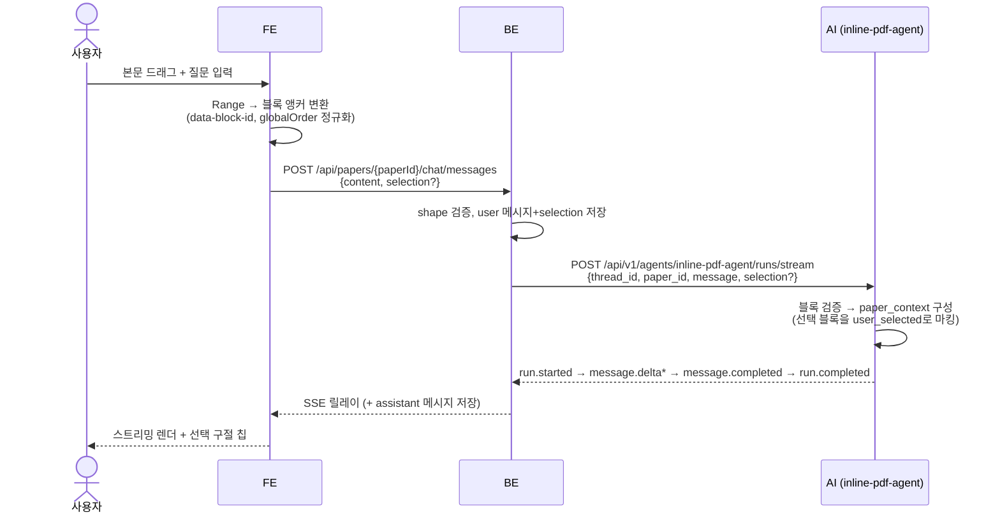
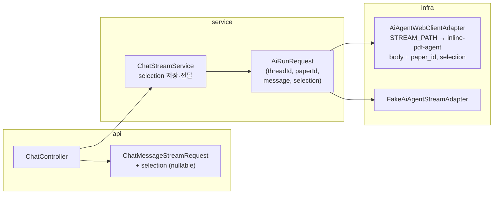

# 채팅 인라인 모드 전환 설계

2026-08-07. FE에서 호출하는 채팅을 simple-agent에서 inline-pdf-agent로 전환한다.

## 현황과 목표

| | 현재 | 전환 후 |
|---|---|---|
| BE→AI 경로 | `simple-agent` (논문 컨텍스트 없음) | `inline-pdf-agent` (논문 전체 + 선택 영역) |
| 선택 구절 전달 | 질문 문자열에 인용문 끼워넣기 | 구조화된 `selection` 필드 (블록 앵커) |
| 저장되는 user 메시지 | 인용문 포함 긴 문자열 | 질문만 + selection 앵커 별도 저장 |
| 이력에서 선택 맥락 | 인용문이 그대로 보임 | FE가 앵커로 본문 텍스트 복원해 칩 표시 |

AI 서버의 inline-pdf-agent는 구현·계약 확정 완료(`contracts/backend-ai/sse/inline-pdf-agent-run-stream.yml`). **AI는 변경 없음.** 작업 범위는 FE↔BE 계약, BE, FE.

## 확정 결정

1. **채팅 전체 교체** — selection 없으면 논문 전체 기반. simple-agent 경로 제거, feature flag 없이 한 번에 전환(dev 단계, 기존 메시지는 selection null로 호환).
2. **selection은 블록 단위** — `block_id`만 전송, offset 생략(계약상 생략 시 블록 전체로 해석). 문자 offset은 렌더링된 DOM↔원본 텍스트 역매핑이 필요해 추후 확장으로 분리. 계약 shape에는 offset을 optional로 포함해 확장 시 계약 재변경이 없게 한다.
3. **인용문 끼워넣기 완전 제거** — content는 질문만. AI에는 앵커로, 화면에는 FE 로컬 복원으로 전달.
4. **selection 저장** — user 메시지에 앵커를 저장하고 이력 조회 응답에 포함.

## 데이터 흐름

실패 시 AI는 `run.failed`(error.code 포함)를 보내고 BE는 기존 relay 에러 경로로 FE에 전달한다.

## 1. 계약 (project-docs — 코드보다 먼저 PR)

`frontend-backend/openapi.yaml`:

- `POST /chat/messages` request에 `selection` 추가 (nullable):
  `{start: {blockId, offset?}, end: {blockId, offset?}}` — BE↔AI 계약과 동일 shape. FE는 당분간 offset을 보내지 않는다고 명시.
- `x-upstream-event-mapping` 참조를 `inline-pdf-agent-run-stream.yml`로 교체. "simple-agent엔 paper_id·canonical history가 없다"는 limitation 제거.
- AI 에러 코드(`SELECTION_*`, `PAPER_*`) → FE 에러 매핑 추가.
- `GET /sessions/{id}/messages` 응답 user 메시지에 `selection` 추가 (nullable).

`contracts/README.md`: sse 트리 4개 파일 반영, `simple-agent-run-stream.yml`은 `status: superseded`.

## 2. BE

- selection 검증은 shape만(start/end 필수, blockId 비어있지 않음). 블록 존재·순서 검증은 구조를 가진 AI가 담당.
- DB: chat 메시지 테이블에 `selection` JSONB 컬럼 (nullable).
- 이벤트에 `paper_id`가 추가로 실려오지만 기존 파서는 무시 — 이벤트 파싱 변경 없음.
- `run.failed`의 새 에러 코드를 FE용 에러로 매핑.

## 3. FE

- **Range→블록 앵커 변환 (신규, 핵심)**: 선택 시작/끝 노드에서 `closest('[data-block-id]')`, 로컬 blocks의 globalOrder로 start/end 정규화(역방향 드래그 대응). DOM에 `data-block-id`는 이미 있음(`PaperViewer`).
- `useTextSelection`: `anchors {start, end}` 반환 추가.
- `TutorPanel.buildContent()`: 인용문 삽입 제거. selection은 `streamChatMessage` → `chatStream.ts` body로 전달.
- **선택 구절 칩**: 전송 시·이력 렌더 시 앵커로 로컬 본문에서 텍스트 복원해 말풍선 위에 표시. 클릭 시 해당 블록으로 스크롤. selection null인 옛 메시지는 칩 없음.
- 앵커 변환 실패(본문 밖 선택 등)는 전송 전 차단. `SELECTION_TOO_LARGE`는 사용자 안내 문구로 표시.

## 4. 테스트

- BE: 어댑터 요청 shape·경로 단위 테스트, selection 저장·이력 응답 테스트.
- FE: Range→앵커 변환 단위 테스트(역방향 드래그, 블록 경계, 본문 밖 선택), 칩 복원 렌더.
- AI: 변경 없음, 기존 테스트 유지.

## 작업 순서

1. contracts PR (openapi.yaml + README)
2. BE (포트·어댑터·DB·저장·이력)
3. FE (앵커 변환 → 전송 → 칩)
